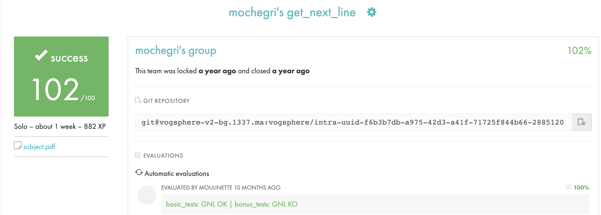

# libft
## Description
May it be a file, stdin, or even later a network connection, you will always need a way to read content line by line. It is time to start working on this function, which will be essential for your future projects.

## Objectives
Unix logic

## Skills
Imperative programming
Algorithms & AI
Rigor

# project page

